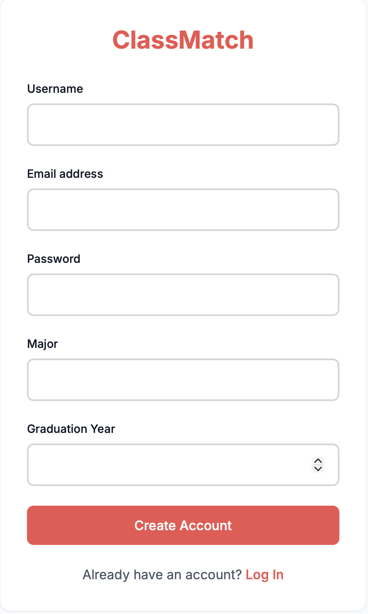
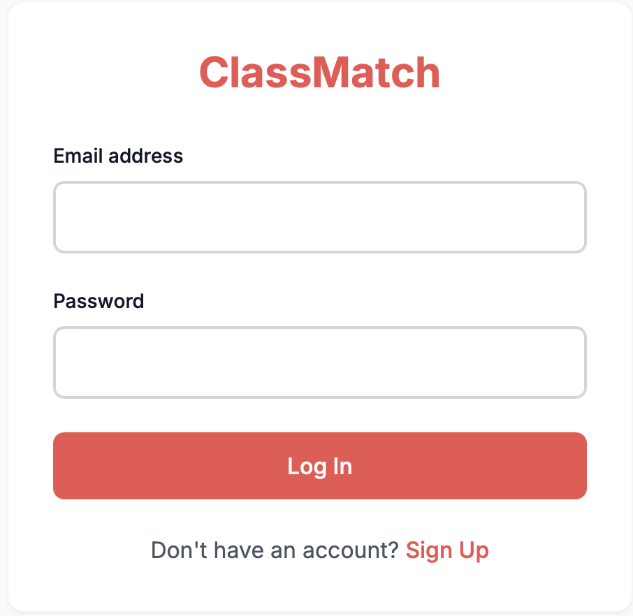
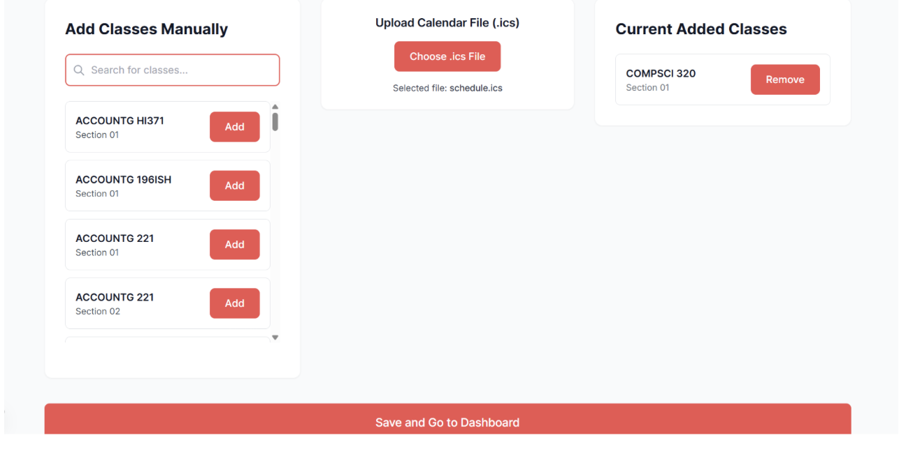
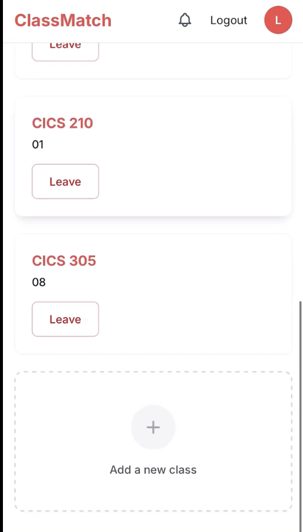
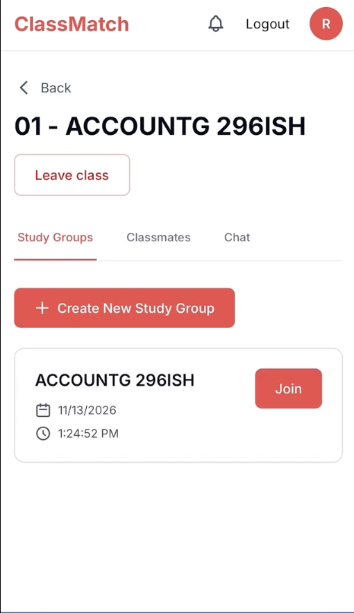
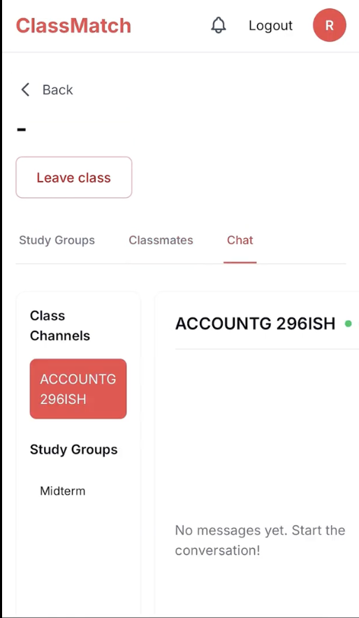
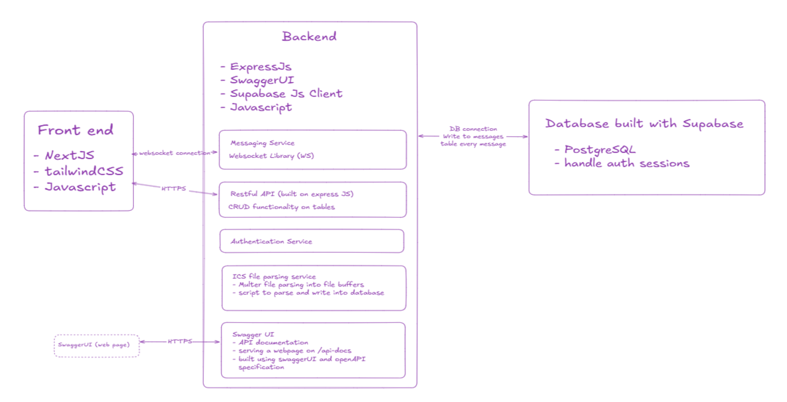
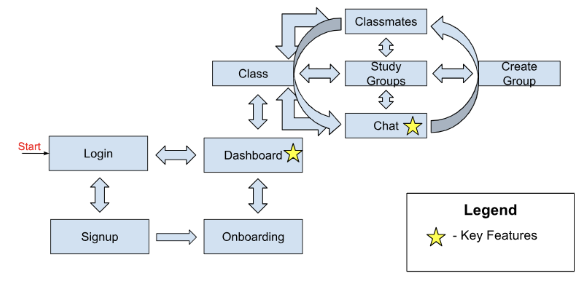
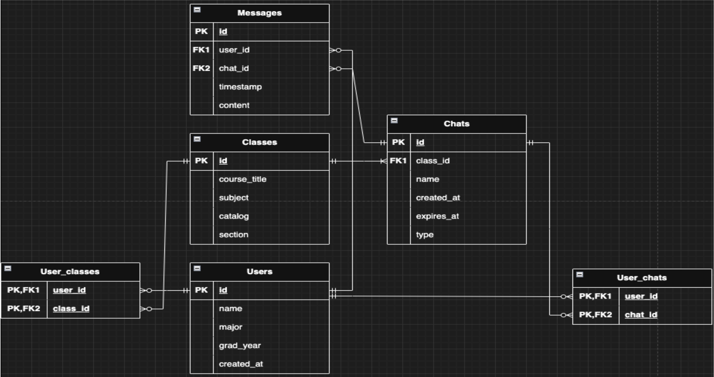

# Class Match

Class Match is a full-stack study-group platform built for UMass students. It helps users add classes, connect with classmates, join real-time chats, and organize study groups in one place. The interface was designed to support both desktop and mobile-friendly use across key workflows.

## Live Demo

[Try the live app](https://320teamone-oyrl.vercel.app/login)
## App Screenshots
> **Tip:** Click any image to expand it for a closer view.
<table>
  <tr>
    <td align="center"><strong>Sign Up</strong></td>
    <td align="center"><strong>Login</strong></td>
    <td align="center"><strong>Onboarding</strong></td>
  </tr>
  <tr>
    <td align="center">
      
    </td>
    <td align="center">
      
    </td>
    <td align="center">
      
    </td>
  </tr>
  <tr>
    <td align="center"><strong>Dashboard</strong></td>
    <td align="center"><strong>Study Groups</strong></td>
    <td align="center"><strong>Chat</strong></td>
  </tr>
  <tr>
    <td align="center">
      
    </td>
    <td align="center">
      
    </td>
    <td align="center">
      
    </td>
  </tr>
</table>

## Overview

The goal of Class Match was to make it easier for students to find peers in their courses and build more organized study communities. The platform supports class-based matching, live chat, study-group creation, and schedule-related workflows to reduce friction when connecting with other students academically.

## Features

- Course-based student matching
- Real-time class and study-group chat
- Study-group creation and scheduling
- Add and remove enrolled classes
- Schedule import support
- Authentication and protected routes
- Mobile-friendly interface
- Backend API documentation through Swagger UI

## Tech Stack

**Frontend**
- Next.js
- Tailwind CSS

**Backend**
- Node.js
- Express.js

**Database / Auth**
- Supabase
- PostgreSQL

**Deployment / Tooling**
- Vercel
- AWS
- Git
- GitHub
- Postman
- Swagger UI

## System Design
> **Tip:** Click any image to expand it for a closer view.
<table>
  <tr>
    <td align="center"><strong>Architecture Diagram</strong></td>
    <td align="center"><strong>UI Diagram</strong></td>
    <td align="center"><strong>ER Diagram</strong></td>
  </tr>
  <tr>
    <td align="center">
      
    </td>
    <td align="center">
      
    </td>
    <td align="center">
      
    </td>
  </tr>
</table>

## Technical Challenges

Some of the main engineering challenges included:

- Implementing real-time messaging with WebSockets
- Integrating frontend and backend endpoints across multiple features
- Supporting ICS schedule import functionality
- Preventing duplicate class enrollment
- Managing database load considerations for live chat writes

## Testing

The application was tested using Postman for backend API validation and manual frontend testing for key user flows and edge cases. Feature validation was also included as part of the pull request review process.

## Setup

### Prerequisites
Consult the frontend README for required dependencies, environment variables, and local setup instructions.
